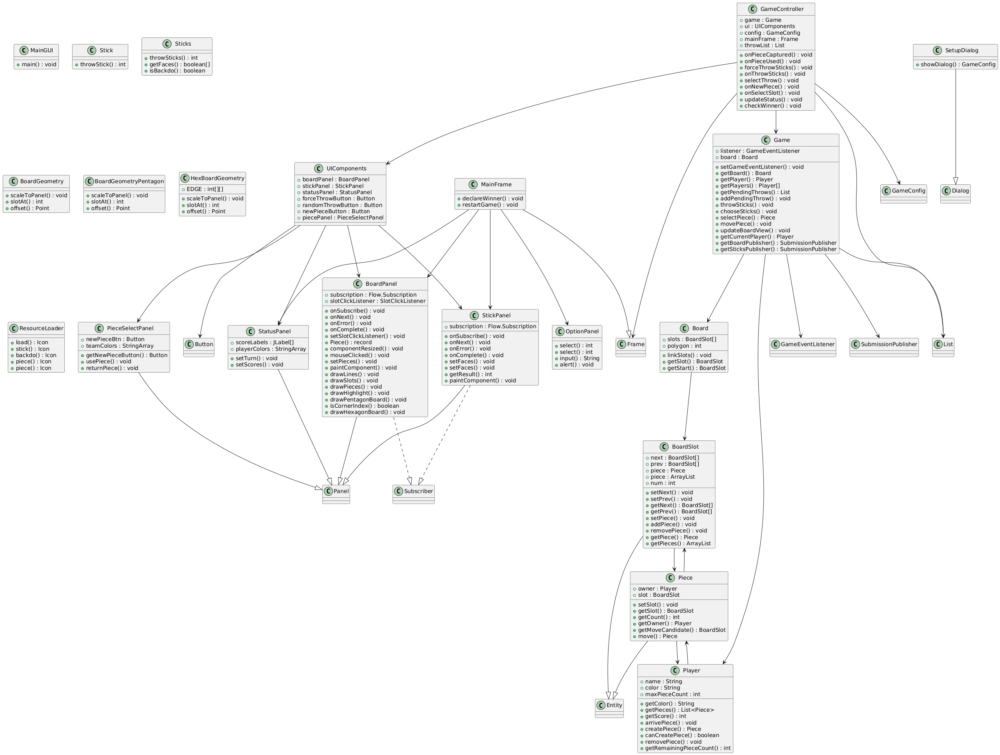
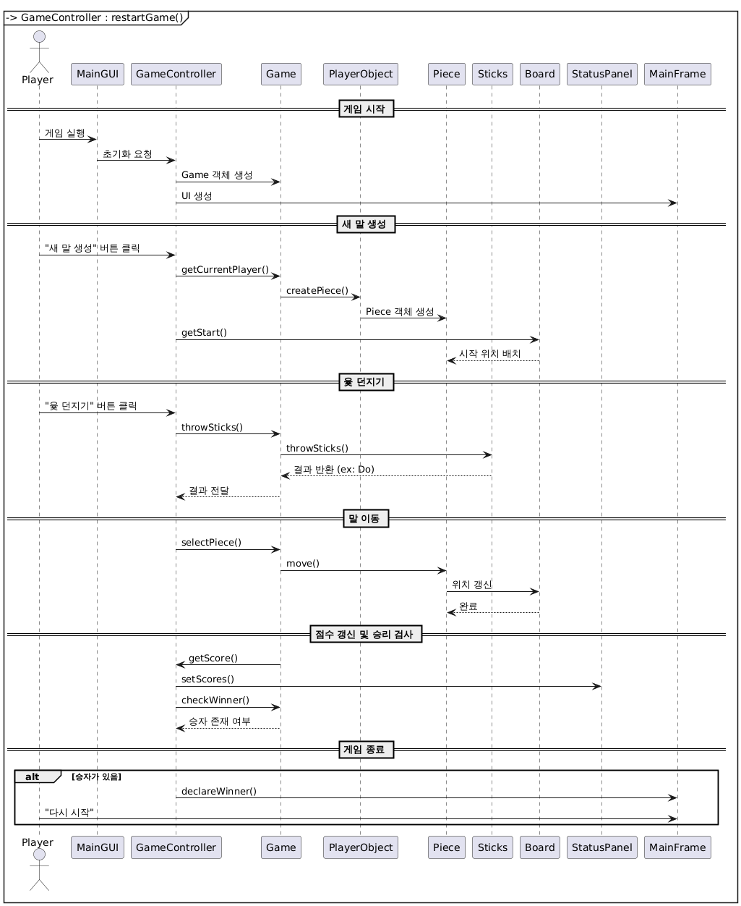

# 소프트웨어공학 Term Project - 윷놀이

## 개요
이 프로젝트는 전통적인 한국 게임인 윷놀이를 구현한 것입니다.

### 기본 구성

- **인원**: 2팀 ~ 4팀
- **도구**:
    - **윷가락**: 한 면은 평평하고 다른 면은 둥근 나무 막대 4개입니다. 
    - **말판**: 말의 이동 경로를 나타내는 판입니다. 
    - **말**: 각 팀은 2~5개의 말을 사용합니다. 

### 윷가락 던지기와 이동 거리

윷가락의 결과에 따라 말의 이동 거리가 결정됩니다:

- **도(돼지)**: 윷가락 1개가 뒤집힌 경우, 1칸 전진합니다. 
- **개(개)**: 윷가락 2개가 뒤집힌 경우, 2칸 전진합니다.
- **걸(양)**: 윷가락 3개가 뒤집힌 경우, 3칸 전진합니다.
- **윷(소)**: 윷가락 4개가 모두 뒤집힌 경우, 4칸 전진하고 한 번 더 던질 수 있습니다.
- **모(말)**: 윷가락 4개가 모두 안 뒤집힌 경우, 5칸 전진하고 한 번 더 던질 수 있습니다. 
- **백도(뒷도)**: 특정 윷가락에 표시를 하여, 해당 윷가락이 다른 방향으로 놓였을 때, 말이 한 칸 뒤로 이동합니다.  

### 말의 이동 및 특수 규칙

- **출발**: 윷가락을 던져 나온 결과에 따라 말을 출발시킵니다. 
- **이동**: 각 결과에 따른 칸 수만큼 말을 이동합니다. 
- **백도 규칙**:
    - 말이 없는 상태에서 백도가 나오면 말을 출발점에 놓을수 있습니다. 
    - 게임 중에 백도가 나오면 현재 위치에서 한 칸 뒤로 이동합니다
- **말 잡기**: 상대방의 말이 있는 칸에 도착하면 그 말을 잡아 출발점으로 되돌리고, 추가로 한 번 더 윷가락을 던질 수 있습니다.
- **말 업기**: 자신의 말이 같은 칸에 있을 경우, 말을 함께 이동시킬 수 있습니다. 업힌 말의 개수 제한은 없습니다. 
- **지름길 이용**: 윷판의 특정 지점에 도착하면 지름길로 이동합니다.

### 승리 조건

모든 말을 결승점까지 이동시킨 팀이 승리합니다. 

## Diagrams
### 1. UML 다이어그램
    
일반적인 윷놀이를 모델링한 UML 다이어그램입니다.     
한 게임은 게임보드, 플레이어, 윷가락으로 구성되어 있습니다.    
게임보드는 각각을 이루는 보드칸들이 모여 이루어져 있습니다.    
그리고 플레이어는 최대 말을 5개 가지고 있으며, 각 말은 보드칸에서 이동합니다.   

### 2. 시퀀스 다이어그램

게임 시작부터 종료까지의 시퀀스 다이어그램입니다.   
GameController 가 UI와 로직 을 연결하는 역할을 합니다.

## 실행
프로젝트의 루트 디렉토리에서 아래 명령어를 실행하여 프로그램을 시작할 수 있습니다. 
```bash
javac -cp ./src -d ./bin .\src\main\MainGUI.java
# 컴파일

java "-cp ./resources;./bin" main.MainGUI
# 실행
# OpenJDK 23에서 실행 확인
```